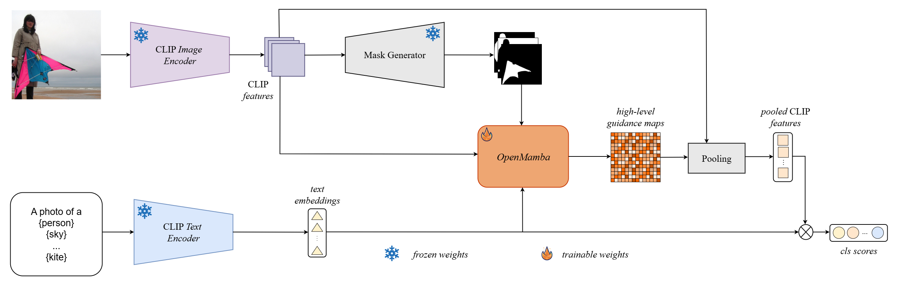

<div align="center">
<h1>OpenMamba</h1>
<h3>OpenMamba:  Introducing State Space Models to Open-Vocabulary Semantic Segmentation</h3>

Viktor Ungur, [Călin-Adrian Popa](https://sites.google.com/site/popacalinadrian)<sup>📧</sup>

Department of Computers and Information Technology, Politehnica University of Timișoara

Publisher: MDPI
Journal: Applied Sciences
Special Issue: Application of Machine Learning to Image Classification and Image Segmentation

(📧 corresponding author)

Paper: (https://www.mdpi.com/2076-3417/15/16/9087)
</div>

## Introduction :book:

Our work introduces OpenMamba, a novel framework for open-vocabulary semantic segmentation based on State-Space Models. Its usage of Mamba architecture yields better performance and uses less memory. The proposed method can be easily be integrated with [MAFT+](https://github.com/jiaosiyu1999/MAFT-Plus) model.

<div align="center">

</div>

## Getting Started :gear:

+ [Installation](INSTALL.md).

+ [Preparing Datasets for OpenMamba](datasets/README.md).

+ [Training & Evaluation](TRAIN_EVAL_GUIDE.md).

## Model weights

We provide the pretrained weights of our model at the following [link](https://drive.google.com/file/d/1yan4vIiY9Uo-snMlBEwvaONIpLljbWF-/view?usp=sharing). The model was trained using a single NVIDIA 4070 Ti GPU.

## Citation

If you find our OpenMamba work useful for your research please use the following BibTeX entry for citation.

```BibTeX
@Article{UngurPopa2025,
  author = {Ungur, Viktor and Popa, C{\u{a}}lin-Alexandru},
  title = {OpenMamba: Introducing State Space Models to Open-Vocabulary Semantic Segmentation},
  journal = {Applied Sciences},
  year = {2025},
  volume = {15},
  number = {16},
  article_number = {9087},
  doi = {10.3390/app15169087},
  url = {https://doi.org/10.3390/app15169087}
}
```

## Acknowledgments

This project is based on VSSD([paper](https://arxiv.org/abs/2407.18559), [code](https://github.com/YuHengsss/VSSD.git)), MTMamba([paper](https://arxiv.org/abs/2407.02228), [code](https://github.com/EnVision-Research/MTMamba.git)), MaskAdapter([paper](https://arxiv.org/abs/2412.04533), [code](https://github.com/hustvl/MaskAdapter.git)), MAFT+([paper](https://arxiv.org/abs/2408.00744v1), [code](https://github.com/jiaosiyu1999/MAFT-Plus)). Many thanks for their excellent work. 